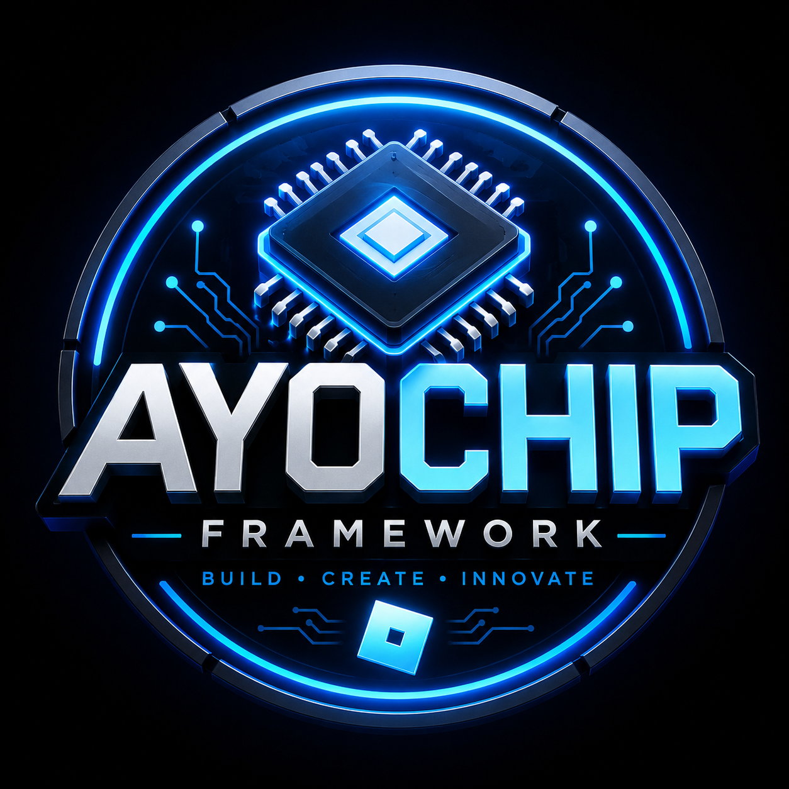

<p align="center">
	
</p>

<h1 align="center">AyoChip Framework</h1>

<p align="center">
Modern Roblox Framework • Custom UI • Tools System • Inventory • Pickup • Modular Architecture
</p>

<p align="center">


</p>

---

# 🚀 About AyoChip

**AyoChip** is a modern Roblox framework built for developers who want:
- clean modular systems
- custom UI framework
- inventory & pickup systems
- tool registration system
- scalable architecture for big games

It is designed to replace messy single-script Roblox projects with a structured framework.

---

# ⚙️ Features

## 🎨 UI System (CustomFrame)
- Rounded modern UI
- UIStroke glow effects
- Tween animations
- Theme support
- Mobile-friendly scaling
- Reusable frame creation

## 🎒 Inventory System
- Slot-based inventory
- Item stacking support
- Player data storage ready

## 🧲 Pickup System
- ProximityPrompt based pickup
- Automatic item handling
- Server-safe structure

## 🧠 Tool Framework
- Register custom tools
- Run tools dynamically
- Modular system design

## 🔔 Notifications
- Simple notify system
- Roblox native UI alerts

## 🎭 Theme System
- Dark theme default
- Accent color system
- Easy customization

---

# 📁 Project Structure

```text
AyoChip/
│
├── framework/
│   ├── Core/
│   ├── UI/
│   │   └── CustomFrame.luau
│   ├── Tools/
│   │   └── ToolFramework.luau
│   ├── Services/
│   │   ├── Inventory.luau
│   │   └── Pickup.luau
│   └── Themes/
│       └── ThemeManager.luau
│
├── src/
│   ├── ServerScriptService/
│   │   └── Main.server.luau
│   ├── StarterPlayer/
│   │   └── StarterPlayerScripts/
│   │       └── Inventory.client.luau
│   ├── ReplicatedStorage/
│   │   ├── Modules/
│   │   └── Remotes/
│   └── StarterGui/
│
├── assets/
│   ├── logo.png
│   ├── banner.png
│   └── icons/
│
├── release/
├── docs/
├── default.project.json
├── rojo.json
├── wally.toml
└── README.md
```

---

# 📦 Installation

## 1. Clone Repository

```bash
git clone https://github.com/YOURNAME/AyoChip.git
```

---

## 2. Install Dependencies

### Rojo
https://github.com/rojo-rbx/rojo

### Wally
https://github.com/UpliftGames/wally

---

## 3. Install Packages

```bash
wally install
```

---

## 4. Open in Roblox Studio

Open synced project using Rojo plugin.

---

# 🏗️ Build System

## Build RBXM

```bash
rojo build default.project.json -o release/AyoChip.rbxm
```

---

## Build for all platforms

- Windows → `AyoChip-Windows.zip`
- Linux → `AyoChip-Linux.zip`
- macOS → `AyoChip-MacOS.zip`

---

# 💡 Example Usage

## Create UI Frame

```lua
local ReplicatedStorage = game:GetService("ReplicatedStorage")

local CustomFrame = require(ReplicatedStorage.Modules.CustomFrame)

local frame = CustomFrame:Create(
	game.Players.LocalPlayer.PlayerGui,
	"Inventory"
)
```

---

## Register Tool

```lua
local ToolFramework = require(ReplicatedStorage.Modules.ToolFramework)

ToolFramework:Register("Inventory", function()
	print("Inventory opened")
end)

ToolFramework:Run("Inventory")
```

---

## Send Notification

```lua
local Notify = require(ReplicatedStorage.Modules.Notify)

Notify:Send("AyoChip Loaded!")
```

---

# 🎮 Supported Platforms

| Platform | Status |
|----------|--------|
| Windows  | ✅ |
| Linux    | ✅ |
| macOS    | ✅ |

---

# 📦 Releases

```text
release/
├── AyoChip.rbxm
├── AyoChip-Windows.zip
├── AyoChip-Linux.zip
└── AyoChip-MacOS.zip
```

---

# 🧠 Roadmap

- [ ] Save Data System
- [ ] Trade System
- [ ] Crates / Lootboxes
- [ ] Animation Engine
- [ ] TopbarPlus Integration
- [ ] Admin Panel
- [ ] Shop System
- [ ] Multiplayer UI Sync

---

# 🧩 Dependencies

- Rojo
- Wally
- Signal
- Promise
- Roblox Studio

---

# 🎨 UI Style

- Dark modern theme
- Blue neon accent (#00AAFF)
- Rounded corners (16px)
- Smooth animations
- Minimal design

---

# 📜 License

MIT License © AyoChip

---

# ⭐ Credits

Made with ❤️ by AyoChip Framework

---

# 📢 Notes

This framework is made for:
- Roblox developers
- UI systems
- modular game architecture
- scalable multiplayer games
